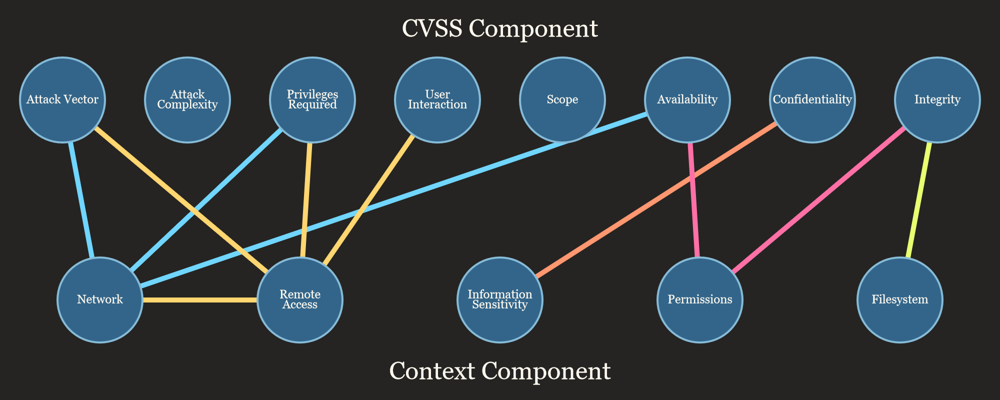

# Deployment-Based Vulnerability Scoring System

## _DBVSS_

DBVSS is a context-based scoring system intended for use in analyzing the security of software deployed to an adaptive
medium.

## Scoring Graph ##

* ### Network Configuration
  The Network Deployment category describes the public internet's access to the deployed service. This category is used
  to evaluate the effect of a network-based vulnerability's impact on the deployed service.
    * #### Public
      The internet has public access to the deployed service through a web server, a database, or a network device.
    * #### Internal
      The internet has public access to an adjacent service but not this service.
    * #### Private
      The internet has no access to the deployed service.

* ### Remote-Access
  The Remote-Access category describes the remote access to the deployed service. This category is used to evaluate the
  effect of a remote-access vulnerability's impact on the deployed service.
    * #### Public
      The deployed service is available to specific users on the wider internet.
    * #### VPN
      The deployed service is available to specific users through a VPN.
    * #### Private
      The deployed service is available to specific users on-site.

* ### Information Sensitivity
  The Information-Sensitivity category describes the sensitivity of the deployed service's information. This category is
  used to analyze the effect of information-targeting vulnerabilities.
    * #### Useless
      The information that the service has access to is in no way sensitive or identifying.
    * #### Insensitive
      The information that the service has access to is not particularly identifying or damaging but may be useful to
      attackers.
    * #### Identifying
      Leaked information identifies users or groups of users. This information is more than likely useful to attackers.
    * #### Damaging
      Leaked information is likely to cause harm without being intentionally weaponized by the attacker.

* ### Command Line Permissions
  Describes the level of commandline access this service has access to. This category is used to analyze the effect of
  code-execution vulnerabilities.
    * ### Full
      The service has superuser privileges.
    * ### Restricted
      The service has more privileges than the average user.
    * ### Standard
      The service has the privileges of a default user.
    * ### Required
      The service only has access to tools absolutely necessary for its operation.
    * ### None
      The service has no access to any commandline tools.

* ### File Permissions
  Describes how much access the service has access to the file-system. This information is used in conjunction with
  information sensitivity to determine the effect of file-system exploits.
  Selection of these categories should fall on the highest value based on read + write. If a service cannot write to
  every file but can read every file, it should be given the "Full" identifier.
    * ### Full
      The service has read or write access to all files on the host machine.
    * ### Restricted
      The service has access to some otherwise restricted files but more than a standard user.
    * ### Standard
      The service has read-only access to otherwise protected file-system files.
    * ### Required
      The service only has access to files required for its operation
    * ### None
      The service does not require or is not given any access to the file system.